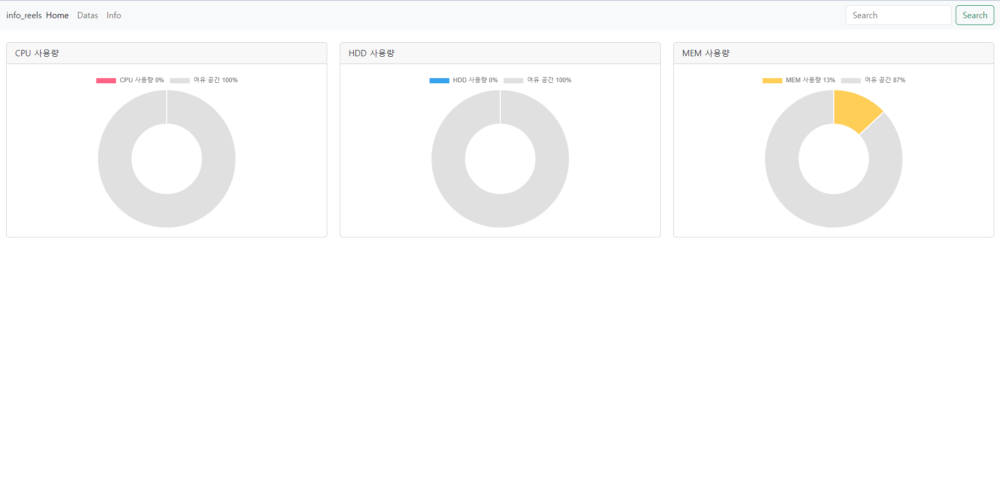
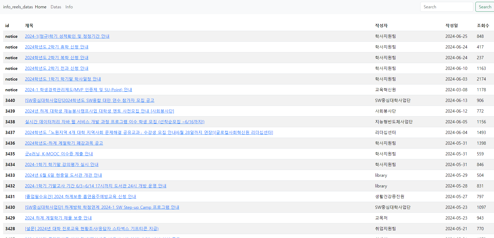
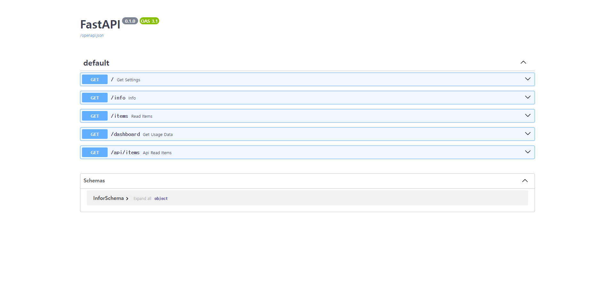

# suya-community

<p align="center">
  
  
  
  
</p>

suya community는 학생들과 함께 만들어가는 꿈의 나라


[개발기여](CONTRIBUTING.md)

## .env는 원칙상 올리지 않는 것이 맞지만 원활한 협업을 위해 추가했습니다.

## Home
대시보드입니다.


## Data
data 미리보기 입니다.
학사정보는 항상 최근 10페이지만 저장되며 오래된 데이터는 데이터 생신 시 지워집니다.
자동 크롤링은 10분에서 20분 사이의 랜덤 시간을 간격으로 작동합니다(너무 일정하게 요청을 보내면 서버 쪽에서 이상하게 생각할 수도 있어서 이렇게 설정했습니다.)


## Info
api 명세서 부분입니다.


## 실행하는 법
step0 : docker-compose.yml 을 실행을 원하는 디렉터리에 위치시킵니다.

step1 : 이후 아래 명령어로 이미지를 pull 합니다.
```bash
docker pull creepereye/info_reels_2:1.0
```
step2 : 다운이 됐으면 아래 명령어로 실행시킵니다.
```bash
docker-compose up
or(안되는 경우)
docker compose up
```
step3
```bash
ipconfig (로 자신의 IP를 찾고 port는 8080을 붙여 들어가시면 됩니다.
ex) 192.168.0.12:8080
```